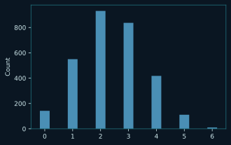

# Estadística

Probabilidad, distribuciones, contrastes y diseño experimental

34 pregunta(s). Las pistas y las respuestas van plegadas: despliégalas solo cuando lo hayas intentado.

[← volver al índice](README.md)

---

## 1. est-norm-cdf

Tienes un conjunto de alturas con distribución normal de media 5,5 pies y desviación típica 2. Si eliges a una persona al azar, ¿cuál es la probabilidad de que mida menos de 4,2 pies?

**Completa el código**

````python
from scipy.stats import norm

probability = norm(loc = 5.5 , scale = 2 ).____________(4.2)

print(probability)
````

**Salida esperada**

````
0.2578461108058647
````

<details>
<summary>Pista</summary>

«Menos que» es acumular toda la cola izquierda hasta ese punto.

</details>

<details>
<summary>Respuesta</summary>

````
cdf
````

`cdf(x)` da la probabilidad acumulada hasta x, es decir P(X ≤ x). Para «mayor que» habría que restarla de 1.

</details>

---

## 2. est-norm-cola-derecha

Tienes un conjunto de pesos con distribución normal de media 70 kg y desviación típica 15 kg. ¿Cuál es la probabilidad de que una persona elegida al azar pese más de 90 kg?

**Completa el código**

````python
from scipy.stats import norm

probability = 1 - norm(loc = 70 , scale = 15 ).cdf(__________)

print(probability)
````

**Salida esperada**

````
0.09121121972586788
````

<details>
<summary>Pista</summary>

El `1 -` de delante ya se encarga de darle la vuelta a la cola.

</details>

<details>
<summary>Respuesta</summary>

````
90
````

P(X > 90) = 1 − P(X ≤ 90) = 1 − cdf(90). La `cdf` siempre acumula por la izquierda, así que la cola derecha se obtiene restando.

</details>

---

## 3. est-binom-pmf

En un país, el 35 % de la población tiene mala visión. En una muestra aleatoria de 10 personas, ¿cuál es la probabilidad de que 5 la tengan?

**Completa el código**

````python
from scipy.stats import binom

prob = binom.____________(5, n=10, p=0.35)

print(f"Probability of 5 people having eyesight out of 10 people is {prob}")
````

**Salida esperada**

````
Probability of 5 people having eyesight out of 10 people is 0.15357041070820307
````

<details>
<summary>Pista</summary>

Se pregunta por un valor exacto, no por un acumulado.

</details>

<details>
<summary>Respuesta</summary>

````
pmf
````

`pmf` (función de masa de probabilidad) da P(X = k) exactamente. `cdf` habría dado P(X ≤ 5).

</details>

---

## 4. est-binom-al-menos-una

En cada una de 4 competiciones distintas, un atleta tiene un 80 % de opciones de ganar. Suponiendo que son independientes, ¿cuál es la probabilidad de que gane al menos una carrera?

**Completa el código**

````python
from scipy.stats import binom

probability = 1 - binom.pmf(k=________, n=4, p=________)

print(probability)
````

**Salida esperada**

````
0.9984
````

<details>
<summary>Pista</summary>

«Al menos una» es lo contrario de «ninguna».

</details>

<details>
<summary>Respuesta</summary>

````
0   ·   0.8
````

P(al menos 1) = 1 − P(0 victorias). Contar el complementario evita sumar los casos de 1, 2, 3 y 4 victorias.

</details>

---

## 5. est-poisson-cdf

Una tienda de juguetes en línea tiene unas ventas que siguen una distribución de Poisson con media de 15 ventas al día. Halla la probabilidad de conseguir al menos 12 ventas el primer día.

**Elige el código que da la salida**

````python
from scipy.stats import poisson

prob = ____
prob_percent = prob*100

print(f"Probability of at least 12 sales in first day is {prob_percent}%")
````

**Opciones**

1. `poisson.cdf(k=12, mu=15)`
2. `1 - poisson.cdf(k=12, mu=15)`
3. `1 - poisson.cdf(k=11, mu=15)`
4. `poisson.cdf(k=11, mu=15)`

**Salida esperada**

````
Probability of at least 12 sales in first day is 81.52482009760685%
````

<details>
<summary>Pista</summary>

«Al menos 12» incluye el 12. La `cdf` acumula hasta k inclusive, así que hay que restar hasta el 11.

</details>

<details>
<summary>Respuesta</summary>

````
1 - poisson.cdf(k=11, mu=15)
````

P(X ≥ 12) = 1 − P(X ≤ 11) = 1 − cdf(11). Usar cdf(12) dejaría fuera el propio 12, que sí cuenta.

</details>

---

## 6. est-expon-rvs

Genera una muestra aleatoria de una distribución exponencial usando el módulo `scipy.stats`.

**Completa el código**

````python
import scipy.stats as stats

sample_dist = stats.________________(size=10, random_state=25)
print('Values:',sample_dist)
````

**Salida esperada**

````
Values: [2.04117618 0.87293657 0.32689278 0.20568587 0.52949911 0.12485548
 1.15508342 0.5755616  0.81244735 0.45741176]
````

<details>
<summary>Pista</summary>

En scipy, el método que saca muestras al azar de una distribución acaba en `rvs`.

</details>

<details>
<summary>Respuesta</summary>

````
expon.rvs
````

`rvs` es *random variates*: devuelve valores simulados de la distribución. Con `random_state` la muestra es reproducible.

</details>

---

## 7. est-binom-rvs

Genera una muestra aleatoria de una distribución binomial usando el módulo `scipy.stats`.

**Completa el código**

````python
import scipy.stats as stats

sample_dist = stats.________________(n=10, p=0.4, size=12, random_state=5)
print(sample_dist)
````

**Salida esperada**

````
[3 6 3 6 4 4 5 4 3 3 2 5]
````

<details>
<summary>Pista</summary>

Misma familia de métodos que en la exponencial.

</details>

<details>
<summary>Respuesta</summary>

````
binom.rvs
````

`binom.rvs(n, p, size)` simula `size` experimentos binomiales de `n` intentos con probabilidad `p`.

</details>

---

## 8. est-numpy-binomial

Las distribuciones binomiales se usan cuando los sucesos tienen dos resultados posibles. Usa la función de NumPy para extraer una muestra de una binomial.

**Completa el código**

````python
from numpy.random import default_rng
import seaborn as sns
import matplotlib.pyplot as plt

rng = default_rng(4)
dist = __________.______________(6, 0.4, 3000)

sns.displot(dist)
plt.show()
````

**Resultado esperado**



<details>
<summary>Pista</summary>

El generador ya está creado en la línea de arriba; el método lleva el nombre de la distribución.

</details>

<details>
<summary>Respuesta</summary>

````
rng   ·   binomial
````

Con el generador moderno de NumPy, las muestras salen del propio objeto: `rng.binomial(n, p, size)`.

</details>

---

## 9. est-chisquare

Usa la prueba chi-cuadrado para contrastar la hipótesis de que el número observado de visitantes por día de la semana (`obs`) coincide con la frecuencia esperada (`exp`).

**Completa el código**

````python
from scipy import stats

obs =[10,10,10,20,50,10,15]
exp = [5,15,10,15,15,10,55]

result = ____________________(obs,exp)

print(result)
````

**Salida esperada**

````
Power_divergenceResult(statistic=119.0909090909091, pvalue=2.5292352048026007e-23)
````

<details>
<summary>Pista</summary>

La función lleva el nombre de la propia prueba.

</details>

<details>
<summary>Respuesta</summary>

````
stats.chisquare
````

`stats.chisquare(obs, exp)` es la prueba de bondad de ajuste: compara lo observado con lo esperado y devuelve el estadístico y su p-valor.

</details>

---

## 10. est-ttest-ind

Tienes un dataframe `df` con las columnas `Country_A` y `Country_B`, con la lluvia diaria en mm de dos países. Ejecuta un t-test independiente para las medias de ambas columnas.

**Datos**

````
|   Country_A |    Country_B |
|------------:|-------------:|
|    21.2435  |    20.2435   |
|     1.11756 |     2.11756  |
|     0.281718|     1.28172  |
|     5.72969 |     6.72969  |
````

**Completa el código**

````python
import pandas as pd
from scipy import stats

statistic,pvalue = stats.________________(df['Country_A'], df['Country_B'])

print(statistic,pvalue)
````

**Salida esperada**

````
0.477579556215368 0.633054059857348
````

<details>
<summary>Pista</summary>

«Independiente» está en el propio nombre de la función.

</details>

<details>
<summary>Respuesta</summary>

````
ttest_ind
````

`ttest_ind` compara las medias de dos muestras independientes. Para datos emparejados se usaría `ttest_rel`.

</details>

---

## 11. est-pingouin-chi2

Un servicio de atención al cliente investiga si el estado de resolución de las quejas depende del canal por el que llegan (Phone, Email, App). Usa el paquete `pingouin` para comprobar si hay relación entre las dos variables.

**Completa el código**

````python
import pingouin as pg

expected, observed, stats = pg.____________________(data=df,
                                     x="channel",
                                     y="status")
print(stats)
````

**Salida esperada**

````
              test  lambda     chi2  dof         pval  cramer  power
0          pearson   1.000  180.000  4.0  7.457e-38   1.000    1.0
1    cressie-read   0.667  174.974  4.0  8.951e-37   0.986    1.0
2  log-likelihood   0.000  197.750  4.0  1.144e-41   1.048    1.0
````

<details>
<summary>Pista</summary>

Dos variables categóricas y la pregunta es si son independientes.

</details>

<details>
<summary>Respuesta</summary>

````
chi2_independence
````

`pg.chi2_independence` es la prueba chi-cuadrado de independencia entre dos variables categóricas; devuelve los esperados, los observados y la tabla de estadísticos.

</details>

---

## 12. est-pearson-conclusion

Dados estos resultados de una correlación de Pearson y un nivel de significación de 0,05 —`r: 0.7111856948395034`, `p-value: 0.06901938475917284`—, ¿qué conclusión se puede sacar?

**Opciones**

1. `Hay una relación lineal fuerte y estadísticamente significativa`
2. `Hay una relación lineal débil y estadísticamente significativa`
3. `No hay relación lineal significativa entre las variables`
4. `No hay información suficiente sobre su relación`

<details>
<summary>Pista</summary>

Compara el p-valor con el nivel de significación antes de mirar la r.

</details>

<details>
<summary>Respuesta</summary>

````
No hay relación lineal significativa entre las variables
````

El p-valor (0,069) es mayor que 0,05, así que no se rechaza la hipótesis nula: la correlación no es significativa. Que la r sea alta no basta si el p-valor no acompaña.

</details>

---

## 13. est-shapiro

Según estos resultados de la prueba de Shapiro-Wilk: `ShapiroResult(statistic=0.9844282269477844, pvalue=0.024980217218399048)`.

**Opciones**

1. `La variable sigue una distribución normal`
2. `La variable no sigue una distribución normal`
3. `No podemos rechazar la hipótesis nula`
4. `Los resultados no son estadísticamente significativos`

<details>
<summary>Pista</summary>

En Shapiro-Wilk la hipótesis nula es que los datos SÍ son normales.

</details>

<details>
<summary>Respuesta</summary>

````
La variable no sigue una distribución normal
````

El p-valor (0,025) es menor que 0,05, así que se rechaza la hipótesis nula de normalidad: los datos no son normales.

</details>

---

## 14. est-chi2-region

Una cadena minorista analiza si el éxito de sus campañas depende de la región. La prueba chi-cuadrado da `chi2 = 1.98851`, `dof = 6.0`, `pval = 0.92163`. Con un nivel de significación de 0,05, ¿qué conclusión sacar?

**Opciones**

1. `No hay asociación significativa entre región y tipo de promoción`
2. `Hay una asociación significativa entre región y tipo de promoción`
3. `El tipo de promoción varía significativamente entre regiones`
4. `Los factores regionales influyen en la eficacia de la promoción`

<details>
<summary>Pista</summary>

Un p-valor de 0,92 está muy lejos de 0,05.

</details>

<details>
<summary>Respuesta</summary>

````
No hay asociación significativa entre región y tipo de promoción
````

Con p = 0,92 no se rechaza la hipótesis nula de independencia: no hay evidencia de asociación entre región y tipo de promoción.

</details>

---

## 15. est-chi2-dependencia

Para seleccionar variables en un modelo de Machine Learning ejecutaste una prueba chi-cuadrado entre una variable independiente y la variable objetivo categórica. Obtuviste `chi2 value: 134.54869375910293` y `p-value: 1.510066805092378e-136`. ¿Qué se concluye?

**Opciones**

1. `La variable dependiente es irrelevante para el modelo`
2. `Las dos variables son independientes entre sí`
3. `Los datos sugieren que las variables son dependientes`
4. `Las variables seleccionadas no están correlacionadas estadísticamente`

<details>
<summary>Pista</summary>

1,5 × 10⁻¹³⁶ es un p-valor extremadamente pequeño.

</details>

<details>
<summary>Respuesta</summary>

````
Los datos sugieren que las variables son dependientes
````

Un p-valor tan bajo rechaza con holgura la independencia: las variables están relacionadas, así que esa variable aporta información al modelo.

</details>

---

## 16. est-chi2-distribucion

¿Qué distribución estadística se define por un único parámetro —los grados de libertad— y se usa para obtener el p-valor al contrastar datos categóricos con recuentos observados y esperados?

**Opciones**

1. `Distribución F`
2. `Distribución binomial`
3. `Distribución normal`
4. `Distribución chi-cuadrado`

<details>
<summary>Pista</summary>

Es la que da nombre a la propia prueba de recuentos.

</details>

<details>
<summary>Respuesta</summary>

````
Distribución chi-cuadrado
````

La chi-cuadrado depende solo de los grados de libertad y es la distribución de referencia de las pruebas de bondad de ajuste y de independencia.

</details>

---

## 17. est-hipotesis-nula

¿Por qué le interesaría a un analista contrastar la hipótesis nula?

**Opciones**

1. `Quiere demostrar que la hipótesis nula y la alternativa son la misma`
2. `La hipótesis nula demostrará que la alternativa es cierta`
3. `Hay una duda sobre el statu quo que el analista quiere poner a prueba`
4. `Quiere aumentar el intervalo de confianza del estudio`

<details>
<summary>Pista</summary>

La hipótesis nula representa «lo que se da por supuesto».

</details>

<details>
<summary>Respuesta</summary>

````
Hay una duda sobre el statu quo que el analista quiere poner a prueba
````

La nula recoge el statu quo. Se contrasta porque hay una sospecha de que no se sostiene; nunca se «demuestra» una hipótesis, solo se rechaza o no la nula.

</details>

---

## 18. est-cola

Una agencia de selección encuestó a más de 300 médicos para calcular su salario medio. La hipótesis alternativa es que los médicos ganan menos de 200.000. ¿Qué tipo de contraste hay que usar para el p-valor?

**Opciones**

1. `Contraste de dos colas`
2. `Contraste de cola izquierda`
3. `Contraste de cola derecha`
4. `Contraste sin colas`

<details>
<summary>Pista</summary>

Fíjate hacia qué lado apunta el «menos que» de la alternativa.

</details>

<details>
<summary>Respuesta</summary>

````
Contraste de cola izquierda
````

La alternativa es «menor que», así que la región de rechazo está toda en la cola izquierda de la distribución.

</details>

---

## 19. est-intervalo-confianza

Se construye un intervalo de confianza del 95 % para la diferencia entre dos diseños web en tiempo medio en el sitio. Si el intervalo resultante es (−1,3 · 2,1), ¿qué se puede inferir sobre la diferencia?

**Opciones**

1. `Hay diferencia significativa porque el intervalo contiene el cero`
2. `No hay diferencia significativa porque el intervalo contiene el cero`
3. `Hay diferencia significativa porque el intervalo no contiene el cero`
4. `No hay diferencia significativa porque el intervalo no contiene el cero`

<details>
<summary>Pista</summary>

¿Está el 0 dentro del intervalo? ¿Qué significaría una diferencia de 0?

</details>

<details>
<summary>Respuesta</summary>

````
No hay diferencia significativa porque el intervalo contiene el cero
````

El intervalo va de −1,3 a 2,1, así que incluye el 0: «ninguna diferencia» es un valor plausible y no se puede afirmar que los diseños difieran.

</details>

---

## 20. est-z-rango

Un z-test es un contraste de hipótesis que se usa cuando la muestra es grande y las varianzas son conocidas. Su resultado se llama estadístico z o z-score. ¿Cuál es el rango del estadístico z?

**Opciones**

1. `0 a 1`
2. `−1 a 1`
3. `0 a ∞`
4. `−∞ a +∞`

<details>
<summary>Pista</summary>

El z-score cuenta desviaciones típicas respecto de la media, y no hay tope.

</details>

<details>
<summary>Respuesta</summary>

````
−∞ a +∞
````

z = (x − μ)/σ puede tomar cualquier valor real: no está acotado por arriba ni por abajo.

</details>

---

## 21. est-f-test

Un t-test se usa para ver si hay diferencia entre las medias de dos grupos. Uno de sus supuestos es que las dos poblaciones tienen varianzas iguales. ¿Qué prueba se puede hacer antes para comprobarlo?

**Opciones**

1. `F-test`
2. `Prueba chi-cuadrado`
3. `Z-test`

<details>
<summary>Pista</summary>

Es la prueba que compara varianzas mediante su cociente.

</details>

<details>
<summary>Respuesta</summary>

````
F-test
````

El F-test contrasta la igualdad de varianzas comparando su cociente con la distribución F. Es el paso previo habitual al t-test.

</details>

---

## 22. est-maxima-verosimilitud

Has observado datos de una muestra de 15 participantes sobre su peso (kg) y supones que siguen una distribución normal. ¿Qué método puedes usar para estimar los parámetros de esa distribución a partir de tus observaciones?

**Opciones**

1. `Estimación por máxima verosimilitud`
2. `Bondad de ajuste chi-cuadrado`
3. `Coeficiente de correlación de Pearson`

<details>
<summary>Pista</summary>

Se busca el parámetro que hace más probables los datos que ya viste.

</details>

<details>
<summary>Respuesta</summary>

````
Estimación por máxima verosimilitud
````

La máxima verosimilitud elige los parámetros que maximizan la probabilidad de haber observado esos datos. Las otras dos opciones no estiman parámetros.

</details>

---

## 23. est-geometrica

Un jugador de baloncesto tiene un 60 % de acierto en tiros libres. ¿Qué distribución usarías para modelar la probabilidad de que enceste su primer tiro libre en el segundo intento?

**Opciones**

1. `Distribución binomial`
2. `Distribución exponencial`
3. `Distribución de Poisson`
4. `Distribución geométrica`

<details>
<summary>Pista</summary>

La pregunta es «cuántos intentos hasta el primer éxito».

</details>

<details>
<summary>Respuesta</summary>

````
Distribución geométrica
````

La geométrica modela el número de intentos hasta el primer éxito. La binomial contaría éxitos en un número fijo de intentos.

</details>

---

## 24. est-poisson-microchips

Eres analista en una fábrica de microchips. Sabes que de media salen 10 chips defectuosos al día. ¿Qué distribución usarías para la probabilidad de que 3 de los chips fabricados en el próximo turno de 8 horas sean defectuosos, suponiendo ritmo de producción constante?

**Opciones**

1. `Distribución de Poisson`
2. `Distribución binomial`
3. `Distribución normal`
4. `Distribución t`

<details>
<summary>Pista</summary>

Hay una tasa media de sucesos por unidad de tiempo, no un número fijo de intentos.

</details>

<details>
<summary>Respuesta</summary>

````
Distribución de Poisson
````

Poisson modela el número de sucesos en un intervalo cuando se conoce la tasa media. La binomial necesitaría un número fijo de ensayos con probabilidad individual.

</details>

---

## 25. est-poisson-lluvia

¿Qué distribución usarías para la probabilidad de que haya menos de cinco días de lluvia el mes que viene, sabiendo que de media hay 50 días de lluvia al año sin diferencias entre estaciones?

**Opciones**

1. `Distribución de Poisson`
2. `Distribución binomial`
3. `Distribución normal`
4. `Distribución chi-cuadrado`

<details>
<summary>Pista</summary>

Otra vez: sucesos contados en un intervalo, con tasa media conocida.

</details>

<details>
<summary>Respuesta</summary>

````
Distribución de Poisson
````

Igual que con los microchips: una tasa media por unidad de tiempo y un recuento de sucesos en un intervalo es el caso típico de Poisson.

</details>

---

## 26. est-validez-interna

Asignar los participantes al azar al grupo de tratamiento o al de control mejora ¿qué cosa en un experimento?

**Opciones**

1. `Confianza estadística`
2. `Frecuencia relativa`
3. `Validez interna`

<details>
<summary>Pista</summary>

Se trata de poder atribuir el efecto al tratamiento y no a otra cosa.

</details>

<details>
<summary>Respuesta</summary>

````
Validez interna
````

La aleatorización reparte las variables de confusión entre los grupos, lo que refuerza la validez interna: la confianza en que el efecto observado se debe al tratamiento.

</details>

---

## 27. est-diseno-experimental

Si quieres establecer el efecto que un factor, o variable independiente, tiene sobre una variable dependiente, tu diseño de investigación debe ser:

**Opciones**

1. `Explicativo`
2. `Experimental`
3. `Correlacional`
4. `Descriptivo`

<details>
<summary>Pista</summary>

Solo un tipo de diseño permite hablar de causa y efecto.

</details>

<details>
<summary>Respuesta</summary>

````
Experimental
````

Solo el diseño experimental —manipulando el factor y controlando el resto— permite atribuir causalidad. El correlacional solo detecta asociación.

</details>

---

## 28. est-solomon

¿Cuál de estos diseños experimentales permite determinar si los cambios en la variable dependiente se deben a un efecto de interacción entre el pretest y el tratamiento?

**Opciones**

1. `Pretest-postest aleatorizado de dos grupos`
2. `Solo postest aleatorizado de dos grupos`
3. `Diseño de cuatro grupos de Solomon`
4. `Diseño factorial`

<details>
<summary>Pista</summary>

Hace falta un diseño que tenga grupos con pretest y grupos sin él.

</details>

<details>
<summary>Respuesta</summary>

````
Diseño de cuatro grupos de Solomon
````

El diseño de Solomon combina cuatro grupos —con y sin pretest, con y sin tratamiento—, que es justo lo que permite aislar el efecto del propio pretest.

</details>

---

## 29. est-bloques

Una cadena hotelera va a hacer un experimento sobre el impacto de distintas estrategias promocionales en las reservas. Tiene hoteles en varias ubicaciones y quiere tener en cuenta las variaciones por ubicación. ¿Qué diseño experimental debería usar?

**Opciones**

1. `Diseño aleatorio estratificado`
2. `Diseño por bloques aleatorizado`
3. `Diseño completamente aleatorio`
4. `Diseño factorial`

<details>
<summary>Pista</summary>

La ubicación es una fuente de variación conocida que conviene agrupar antes de aleatorizar.

</details>

<details>
<summary>Respuesta</summary>

````
Diseño por bloques aleatorizado
````

En el diseño por bloques se agrupa por la variable molesta —aquí la ubicación— y se aleatoriza dentro de cada bloque, para que esa variación no se confunda con el efecto de la promoción.

</details>

---

## 30. est-matching

Diseñas un experimento sobre el efecto de fumar puros en la diabetes. Para controlar variables de confusión has identificado dos grupos de personas iguales en sexo, peso, clase social, estudios y ejercicio, salvo que uno fuma y el otro no. ¿Qué estrategia de control has usado?

**Opciones**

1. `Doble ciego`
2. `Estratificación`
3. `Estudio de cohortes`
4. `Emparejamiento`

<details>
<summary>Pista</summary>

Los dos grupos se han hecho coincidir uno a uno en todo lo demás.

</details>

<details>
<summary>Respuesta</summary>

````
Emparejamiento
````

El emparejamiento (*matching*) consiste en construir grupos equivalentes en las variables de confusión, de forma que la única diferencia sea la que se estudia.

</details>

---

## 31. est-media-vs-desviacion

¿Cuál es la diferencia entre la media y la desviación estándar?

**Opciones**

1. `La media es la mediana de los datos, mientras que la desviación estándar mide la variabilidad.`
2. `La media mide la variabilidad de los datos, mientras que la desviación estándar mide la moda.`
3. `La media mide la variabilidad de los datos, mientras que la desviación estándar mide el valor central.`
4. `La media es el promedio de los datos, mientras que la desviación estándar mide la dispersión de los datos alrededor de la media.`

<details>
<summary>Pista</summary>

Una responde «¿por dónde está el centro?» y la otra «¿qué tan lejos del centro caen los datos?».

</details>

<details>
<summary>Respuesta</summary>

````
La media es el promedio de los datos, mientras que la desviación estándar mide la dispersión de los datos alrededor de la media.
````

La media es una medida de posición: el promedio. La desviación estándar es una medida de dispersión, la raíz de la varianza, y dice cuánto se separan los datos de esa media.

</details>

---

## 32. est-t-student

¿En qué caso se utiliza una prueba t de Student?

**Opciones**

1. `Para comparar la media de dos grupos independientes.`
2. `Para evaluar la relación no lineal entre dos variables.`
3. `Para comparar la media de más de dos grupos independientes.`
4. `Para medir la correlación entre dos variables.`

<details>
<summary>Pista</summary>

Fíjate en cuántos grupos admite. Con más de esos, la prueba se queda corta.

</details>

<details>
<summary>Respuesta</summary>

````
Para comparar la media de dos grupos independientes.
````

La t de Student contrasta las medias de dos grupos. Con tres o más se usa ANOVA, porque repetir pruebas t por parejas infla el error de tipo I.

</details>

---

## 33. est-intervalo-90-95

Si el intervalo de confianza al 90 % para la media de una población es (44; 75), ¿cuál podría ser el intervalo al 95 % de confianza?

**Opciones**

1. `(44; 79)`
2. `(40; 79)`
3. `(40; 75)`
4. `(44; 75)`

<details>
<summary>Pista</summary>

Más confianza pide más margen, y el intervalo sigue centrado en la misma media.

</details>

<details>
<summary>Respuesta</summary>

````
(40; 79)
````

Al subir del 90 % al 95 % el valor crítico crece, así que el intervalo se ensancha por los dos lados sin moverse de su centro. (44; 75) está centrado en 59,5 y solo (40; 79) mantiene ese centro siendo más ancho; las otras dos lo desplazan.

</details>

---

## 34. est-significancia-lm

Según el ajuste de este modelo de regresión lineal múltiple, ¿cuáles son las variables más significativas?

**Datos**

````
Coefficients:
                 Estimate Std. Error t value Pr(>|t|)
(Intercept)     6.995e+01  1.843e+00  37.956  < 2e-16 ***
habitantes      6.480e-05  3.001e-05   2.159   0.0367 *
ingresos        2.701e-04  3.087e-04   0.875   0.3867
analfabetismo   3.029e-01  4.024e-01   0.753   0.4559
asesinatos     -3.286e-01  4.941e-02  -6.652 5.12e-08 ***
universitarios  4.291e-02  2.332e-02   1.840   0.0730 .
heladas        -4.580e-03  3.189e-03  -1.436   0.1585
area           -1.558e-06  1.914e-06  -0.814   0.4205
densidad_pobl  -1.105e-03  7.312e-04  -1.511   0.1385
````

**Opciones**

1. `Analfabetismo, Area`
2. `Asesinatos, Habitantes`
3. `Habitantes, Heladas`
4. `Intercepto`

<details>
<summary>Pista</summary>

Mira la columna `Pr(>|t|)` y las estrellas del final: marcan los p-valores por debajo de 0,05.

</details>

<details>
<summary>Respuesta</summary>

````
Asesinatos, Habitantes
````

Solo `asesinatos` (5.12e-08) y `habitantes` (0.0367) bajan de 0,05. El intercepto es significativo pero no es una variable explicativa, y `universitarios` (0.0730) se queda en el 10 %, no en el 5 %.

</details>

---
