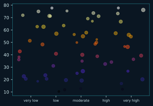
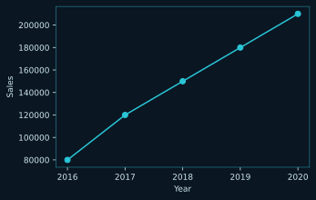
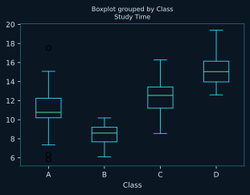
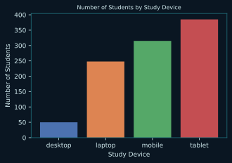
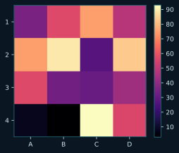

# Visualización

Gráficos con matplotlib y seaborn

5 pregunta(s). Las pistas y las respuestas van plegadas: despliégalas solo cuando lo hayas intentado.

[← volver al índice](README.md)

---

## 1. viz-xticks

Usando el módulo `matplotlib.pyplot`, completa el código para fijar nuevas posiciones y etiquetas de las marcas del eje x.

**Completa el código**

````python
import matplotlib.pyplot as plt

plt.scatter(trait_a, trait_b,s=size, alpha=.5, cmap='CMRmap')
plt.____________([10,20,30,40,50],['very low','low','moderate','high','very high'])
plt.show()
````

**Resultado esperado**



<details>
<summary>Pista</summary>

La función recibe dos listas: dónde van las marcas y qué pone en cada una.

</details>

<details>
<summary>Respuesta</summary>

````
xticks
````

`plt.xticks(posiciones, etiquetas)` sustituye los números del eje x por el texto que le pases. Para el eje y sería `yticks`.

</details>

---

## 2. viz-plot-lineas

Tienes un dataset `df` con las ventas de cinco años de una empresa. Crea un gráfico de líneas para ver la tendencia de las ventas con `matplotlib`.

**Datos**

````
   year   sales
0  2016   80000
1  2017  120000
2  2018  150000
3  2019  180000
4  2020  210000
````

**Completa el código**

````python
import pandas as pd
import matplotlib.pyplot as plt

# create line plot for df
plt.__________(______________, ______________, marker='o')

plt.xlabel('Year')
plt.xticks(df['year'])
plt.ylabel('Sales')

plt.show()
````

**Resultado esperado**



<details>
<summary>Pista</summary>

Primero el eje x, después el eje y.

</details>

<details>
<summary>Respuesta</summary>

````
plot   ·   df['year']   ·   df['sales']
````

`plt.plot(x, y)` une los puntos con líneas. `marker='o'` además marca cada observación.

</details>

---

## 3. viz-boxplot

Una universidad analiza el rendimiento de los alumnos de cuatro clases. El dataframe `df` tiene el nombre de la clase, las notas y el tiempo de estudio. ¿Cómo creas un diagrama de caja para comparar la distribución de `Study Time` en cada clase?

**Datos**

````
  Class  Score  Study Time
0     A     85          10
1     A     90          15
2     A     78          12
3     A     92           8
4     B     76          14
````

**Completa el código**

````python
import pandas as pd
import matplotlib.pyplot as plt

df.____________(________='Class', __________='Study Time')
plt.show()
````

**Resultado esperado**



<details>
<summary>Pista</summary>

`by` dice cómo agrupar; `column` dice qué variable se dibuja.

</details>

<details>
<summary>Respuesta</summary>

````
boxplot   ·   by   ·   column
````

`df.boxplot(by='Class', column='Study Time')` genera una caja por clase. Es el atajo de pandas sobre matplotlib.

</details>

---

## 4. viz-countplot

El dataset `df` recoge las horas de estudio, el dispositivo usado y las notas de unos alumnos. Usa `seaborn` para crear un gráfico con el número de observaciones de cada dispositivo.

**Completa el código**

````python
import matplotlib.pyplot as plt
import seaborn as sns

# create plot
sns.______________(x='study_device', data=df,
             order=df['study_device'].value_counts().sort_values().index)

plt.xlabel('Study Device')
plt.ylabel('Number of Students')
plt.title('Number of Students by Study Device')

plt.show()
````

**Resultado esperado**



<details>
<summary>Pista</summary>

Cuenta cuántas filas hay de cada categoría, sin que le pases tú los totales.

</details>

<details>
<summary>Respuesta</summary>

````
countplot
````

`sns.countplot` hace el recuento por categoría y lo dibuja. Con `barplot` habrías tenido que calcular los totales antes.

</details>

---

## 5. viz-heatmap

Dada una tabla de pandas `df`, haz un mapa de calor anclando los colores a los valores máximo y mínimo de la tabla.

**Datos**

````
    A   B   C   D
1  35  57  75  48
2  75  89  27  83
3  57  33  31  43
4   8   3  93  56
````

**Completa el código**

````python
import seaborn as sns
import matplotlib.pyplot as plt

min_val = df.min().min()
max_val = df.max().max()

sns.heatmap(data=df, __________=min_val, __________=max_val)
plt.show()
````

**Resultado esperado**



<details>
<summary>Pista</summary>

Los dos argumentos empiezan igual: fijan los extremos de la escala de color.

</details>

<details>
<summary>Respuesta</summary>

````
vmin   ·   vmax
````

`vmin` y `vmax` fijan los límites de la escala de color. Sin ellos, seaborn los deduce de los datos y dos mapas distintos no serían comparables.

</details>

---
