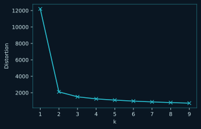
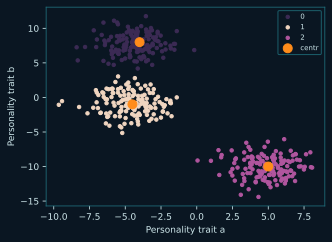

# Machine Learning

Regresión, clustering y reducción

19 pregunta(s). Las pistas y las respuestas van plegadas: despliégalas solo cuando lo hayas intentado.

[← volver al índice](README.md)

---

## 1. ml-poly

Dados los arrays `x` e `y`, donde `y` tiene una relación no lineal con `x`, ajusta un modelo de regresión polinómica de grado 3 para predecir `y` a partir de `x`.

**Completa el código**

````python
from sklearn.preprocessing import PolynomialFeatures
from sklearn import linear_model

poly = PolynomialFeatures(degree=3)
X_poly = poly.__________________(x.reshape(-1, 1))

model = linear_model.____________________()
model.__________(X_poly, y)

print(f"Coefficients: {model.coef_}")
````

**Salida esperada**

````
Coefficients: [ 0.         -3.19672619  0.43166652  1.00872543]
````

<details>
<summary>Pista</summary>

La regresión polinómica es una regresión lineal sobre variables transformadas: primero se generan las potencias, luego se ajusta.

</details>

<details>
<summary>Respuesta</summary>

````
fit_transform   ·   LinearRegression   ·   fit
````

`fit_transform` aprende y aplica la expansión polinómica de una vez. Sobre esas columnas nuevas, una `LinearRegression` normal captura la relación no lineal.

</details>

---

## 2. ml-feature-scaling

¿En cuál de los siguientes algoritmos podemos usar escalado de variables durante el preprocesamiento?

**Opciones**

1. `Naive Bayes`
2. `Gradient Descent`
3. `Árboles de decisión`
4. `Análisis discriminante lineal`

<details>
<summary>Pista</summary>

Piensa en cuál de ellos depende de la magnitud de las variables para converger.

</details>

<details>
<summary>Respuesta</summary>

````
Gradient Descent
````

El descenso de gradiente converge mucho más rápido con variables en escalas parecidas. Los árboles parten por umbrales y son indiferentes a la escala.

</details>

---

## 3. ml-r2-cero

Un R² de 0 indica:

**Opciones**

1. `Que el puntaje es perfecto`
2. `Que lo predijimos todo mal`
3. `Que no hay diferencia entre la línea del modelo y la línea de la media`
4. `Que la línea del modelo y la de la media son completamente distintas`

<details>
<summary>Pista</summary>

El R² compara tu modelo contra un modelo trivial: predecir siempre la media.

</details>

<details>
<summary>Respuesta</summary>

````
Que no hay diferencia entre la línea del modelo y la línea de la media
````

R² = 0 significa que el modelo explica tanta varianza como predecir siempre la media, es decir, ninguna. No implica que las predicciones sean disparatadas: para eso el R² sería negativo.

</details>

---

## 4. ml-inertia

La inercia mide cómo de bien agrupó los datos el modelo K-Means. Usa el método del codo para calcular el mejor número de clusters.

**Completa el código**

````python
from sklearn.cluster import KMeans
import matplotlib.pyplot as plt
import pandas as pd

df = pd.DataFrame(dataset, columns=['trait_a', 'trait_b'])

K = range(1,10)
distortions = []

for k in K:
    model = KMeans(n_clusters=k)
    model.fit(df)
    distortions.append(model.______________)

plt.plot(K, distortions, 'bx-')
plt.xlabel('k')
plt.ylabel('Distortion')
plt.show()
````

**Resultado esperado**



<details>
<summary>Pista</summary>

Es un atributo que scikit-learn deja tras entrenar; por convención acaba en guion bajo.

</details>

<details>
<summary>Respuesta</summary>

````
inertia_
````

`inertia_` es la suma de distancias al cuadrado de cada punto a su centroide. El «codo» de la curva marca el punto donde añadir clusters deja de compensar.

</details>

---

## 5. ml-kmeans-plot

Completa las gráficas para visualizar los resultados del modelo K-Means.

**Completa el código**

````python
from sklearn.cluster import KMeans
import matplotlib.pyplot as plt
import seaborn as sns
import pandas as pd

df = pd.DataFrame(dataset, columns=['trait_a', 'trait_b'])

# model
model = KMeans(n_clusters=3, random_state=10).fit(df)
labels = model.labels_
centers = model.cluster_centers_

# plot
sns.________________(data=df, x="trait_a", y="trait_b", hue=model.labels_)
plt.xlabel('Personality trait a')
plt.ylabel('Personality trait b')
plt.______________(model.cluster_centers_[:,0], model.cluster_centers_[:,1], marker="o", s=80, label="centr")
plt.legend()
plt.show()
````

**Resultado esperado**



<details>
<summary>Pista</summary>

Seaborn y matplotlib no llaman igual a la misma gráfica de dispersión.

</details>

<details>
<summary>Respuesta</summary>

````
scatterplot   ·   scatter
````

En seaborn es `scatterplot` (acepta `data=` y `hue=`); en matplotlib, `plt.scatter`, que aquí dibuja los centroides encima.

</details>

---

## 6. ml-normalizar

Los datasets del mundo real contienen variables con magnitudes y rangos muy distintos. ¿Cuándo deberíamos normalizarlas para preparar los datos del modelo?

**Opciones**

1. `Cuando el algoritmo del modelo usa la distancia euclidiana como medida, y regularización como función de pérdida.`
2. `Cuando la escala de la variable es significativa y aporta información sobre el dataset.`
3. `Cuando el algoritmo del modelo no usa la distancia euclidiana como medida ni el modelo usa regularización como función de pérdida.`

<details>
<summary>Pista</summary>

¿Qué le pasa a una distancia si una variable va de 0 a 1 y otra de 0 a 100000?

</details>

<details>
<summary>Respuesta</summary>

````
Cuando el algoritmo del modelo usa la distancia euclidiana como medida, y regularización como función de pérdida.
````

Si el algoritmo mide distancias o penaliza coeficientes, la variable de mayor magnitud domina el resultado. Normalizar pone a todas en pie de igualdad.

</details>

---

## 7. ml-isomap

Completa la sentencia usando la función de reducción de dimensionalidad no lineal de scikit-learn Isometric Mapping.

**Completa el código**

````python
model = ______________(n_components=2)
result = model.fit_transform(df)

print(result.shape)
````

**Salida esperada**

````
(1000, 2)
````

<details>
<summary>Pista</summary>

El nombre de la clase es la contracción de «Isometric Mapping».

</details>

<details>
<summary>Respuesta</summary>

````
Isomap
````

`Isomap` (en `sklearn.manifold`) conserva las distancias geodésicas sobre la variedad, a diferencia de PCA, que solo hace proyecciones lineales.

</details>

---

## 8. ml-silhouette

Completa los argumentos para calcular el coeficiente de silueta y evaluar la calidad del modelo K-Means.

**Completa el código**

````python
from sklearn.datasets import make_blobs
from sklearn.cluster import KMeans
from sklearn import metrics
import pandas as pd

df = pd.DataFrame(dataset, columns=['price', 'sales'])

model = KMeans(n_clusters=3, random_state=10).fit(df)
labels = model.labels_
centers = model.cluster_centers_

model_performance = metrics.silhouette_score(____________, ________________)
print(model_performance)
````

**Salida esperada**

````
0.8547241290990003
````

<details>
<summary>Pista</summary>

La función necesita los datos originales y a qué cluster fue a parar cada punto.

</details>

<details>
<summary>Respuesta</summary>

````
df   ·   labels
````

`silhouette_score(X, labels)` compara, para cada punto, su distancia media dentro del cluster con la del cluster más cercano. Cerca de 1 es una separación limpia.

</details>

---

## 9. ml-pca

Tienes un dataset con medidas de flores iris: largo y ancho del sépalo, largo y ancho del pétalo. Reduce la dimensionalidad de 4 a 2 dimensiones usando PCA, preservando la mayor varianza posible.

**Completa el código**

````python
import numpy as np
from sklearn.decomposition import __________

# Original data
X = X

# Initialize PCA
pca = __________(n_components=2)

# Fit PCA on data
X_reduced = pca.__________________(X)

print(f"Reduced shape: {X_reduced.shape}")
````

**Salida esperada**

````
Reduced shape: (150, 2)
````

<details>
<summary>Pista</summary>

El tercer hueco tiene que ajustar y transformar en un solo paso, porque `X_reduced` recibe los datos ya proyectados.

</details>

<details>
<summary>Respuesta</summary>

````
PCA   ·   PCA   ·   fit_transform
````

`fit_transform` calcula las componentes principales y proyecta los datos sobre ellas. Con solo `fit` no habría nada que asignar a `X_reduced`.

</details>

---

## 10. ml-logit

Completa la sentencia para ejecutar un modelo de regresión logística que clasifique el comportamiento de los usuarios.

**Completa el código**

````python
import statsmodels.api as sm

y_train = df[['behavior']]

results = sm.____________(y_train, X_train).fit()

print(results.params)
````

**Salida esperada**

````
Optimization terminated successfully.
        Current function value: 0.686701
        Iterations 4
A    0.157
B   -0.076
C    0.101
dtype: float64
````

<details>
<summary>Pista</summary>

En statsmodels la clase no se llama LogisticRegression; ese es el nombre de scikit-learn.

</details>

<details>
<summary>Respuesta</summary>

````
Logit
````

`sm.Logit(y, X)` construye el modelo logístico de statsmodels; `.fit()` lo estima por máxima verosimilitud, de ahí el mensaje de optimización.

</details>

---

## 11. ml-ols

El array `sizes` contiene el tamaño (en pies cuadrados) de 50 casas y `prices` sus precios (en miles de dólares). Ajusta un modelo de mínimos cuadrados ordinarios para predecir `prices` a partir de `sizes`.

**Completa el código**

````python
import numpy as np
from sklearn import linear_model

model = linear_model.____________________()
model.__________(sizes.reshape(-1,1), prices)

coef = model.coef_[0]
intercept = model.intercept_

print(f"Model: price = {intercept:.2f} + {coef:.4f} * size")
````

**Salida esperada**

````
Model: price = 31.92 + 0.1104 * size
````

<details>
<summary>Pista</summary>

En scikit-learn todos los modelos se entrenan con el mismo método.

</details>

<details>
<summary>Respuesta</summary>

````
LinearRegression   ·   fit
````

`LinearRegression` de scikit-learn resuelve mínimos cuadrados ordinarios, y `.fit(X, y)` es el método de entrenamiento común a toda la librería.

</details>

---

## 12. ml-rsquared-adj

Tienes valores numéricos para un dataset x, y. Quieres calcular el coeficiente de determinación ajustado entre x e y después de ajustar una regresión por mínimos cuadrados ordinarios. Completa el código para hacer ese cálculo.

**Elige el código que da la salida**

````python
import statsmodels.api as sm
x = [53 129, 180, 431]
y = [30, 48, 79, 102]
model = sm.OLS(y,x).fit()
````

**Opciones**

1. `model.rsquared_adj`
2. `model.adj_coef_det`
3. `model.coef_det2_adj`
4. `model.adj_rsquared`

<details>
<summary>Pista</summary>

statsmodels pone primero el nombre de la métrica y después el sufijo del ajuste.

</details>

<details>
<summary>Respuesta</summary>

````
model.rsquared_adj
````

El atributo es `rsquared_adj`. El R² ajustado penaliza añadir variables que no aportan, a diferencia del R² normal, que nunca baja al sumar predictores.

</details>

---

## 13. ml-imputer-constante

Tienes un dataset `df` con valores faltantes en la columna `payment_method`. Sustitúyelos por `'Card'` usando la librería `sklearn`.

**Elige el código que da la salida**

````python
from sklearn.impute import SimpleImputer

imp = SimpleImputer(____)
df['payment_method'] = imp.fit_transform(df[['payment_method']])
````

**Opciones**

1. `strategy = 'constant', fill_value = 'Card'`
2. `strategy = 'values', fill_value = 'Card'`
3. `strategy = 'values', fill = 'Card'`
4. `strategy = 'constant', fill = 'Card'`

<details>
<summary>Pista</summary>

Una estrategia dice «usa siempre el mismo valor» y otro argumento dice cuál.

</details>

<details>
<summary>Respuesta</summary>

````
strategy = 'constant', fill_value = 'Card'
````

`strategy='constant'` indica que se rellena con un valor fijo, y `fill_value` es ese valor. `fill` no existe como argumento.

</details>

---

## 14. ml-imputer-frecuente

Tienes un dataset `df` con valores faltantes en la columna `number_of_clients`. Sustitúyelos por el valor más común usando la librería `sklearn`.

**Elige el código que da la salida**

````python
from sklearn.impute import SimpleImputer

imputer = SimpleImputer(strategy='____')
df['number_of_clients'] = imputer.fit_transform(df[['number_of_clients']])
````

**Opciones**

1. `median`
2. `mean`
3. `most_frequent`
4. `mode`

<details>
<summary>Pista</summary>

El nombre que usa scikit-learn no es el término estadístico.

</details>

<details>
<summary>Respuesta</summary>

````
most_frequent
````

En `SimpleImputer` la estrategia de la moda se llama `most_frequent`; `mode` no es un valor válido y lanzaría un error.

</details>

---

## 15. ml-missingness

Una empresa de transporte ha recogido datos de las horas de llegada de sus autobuses. Por atascos y fallos del sistema de seguimiento, se perdió el 5 % de los datos. La empresa no encuentra ningún patrón ni motivo. ¿Qué tipo de ausencia hay aquí?

**Opciones**

1. `Missing at Random (MAR)`
2. `Missing Completely at Random (MCAR)`
3. `Missing Not at Random (MNAR)`

<details>
<summary>Pista</summary>

La clave está en que no hay ningún patrón, ni relacionado con otras variables ni con el propio valor.

</details>

<details>
<summary>Respuesta</summary>

````
Missing Completely at Random (MCAR)
````

MCAR es cuando la ausencia no depende de nada. En MAR dependería de otras variables observadas, y en MNAR del propio valor que falta.

</details>

---

## 16. ml-sin-transformacion

Si tienes un dataset donde la variable dependiente tiene varianza constante en los distintos niveles de las variables independientes, ¿qué tipo de transformación deberías usar?

**Opciones**

1. `Transformación raíz cuadrada`
2. `Transformación logarítmica`
3. `Transformación Box-Cox`
4. `Ninguna transformación`

<details>
<summary>Pista</summary>

Varianza constante es justo lo que se busca conseguir transformando.

</details>

<details>
<summary>Respuesta</summary>

````
Ninguna transformación
````

La homocedasticidad —varianza constante— ya es el supuesto que se quiere cumplir. Si se cumple, transformar no arregla nada y solo complica la interpretación.

</details>

---

## 17. ml-matriz-confusion

¿Qué información proporciona una matriz de confusión?

**Opciones**

1. `La dispersión de los datos alrededor de la media.`
2. `La relación entre dos variables.`
3. `La cantidad de verdaderos positivos, verdaderos negativos, falsos positivos y falsos negativos.`
4. `La media y la mediana de los datos.`

<details>
<summary>Pista</summary>

Cruza lo que el modelo predijo contra lo que la clase realmente era.

</details>

<details>
<summary>Respuesta</summary>

````
La cantidad de verdaderos positivos, verdaderos negativos, falsos positivos y falsos negativos.
````

De esas cuatro casillas salen todas las métricas de clasificación: exactitud, precisión, recall y F1. Por eso importa mirarla y no solo el porcentaje de aciertos.

</details>

---

## 18. ml-validacion-cruzada

¿Cuál es el objetivo de realizar validación cruzada durante el entrenamiento de un modelo analítico?

**Opciones**

1. `Encontrar los mejores hiperparámetros que obtienen el mejor performance del modelo analítico.`
2. `Evaluar el desempeño del modelo analítico cruzando los resultados de los modelos analíticos.`
3. `Encontrar los mejores hiperparámetros que obtienen el mejor resultado de ajuste del modelo analítico evitando el sobreentrenamiento.`
4. `Imponer restricciones a los hiperparámetros para evitar el riesgo de sobreajuste.`

<details>
<summary>Pista</summary>

Hay dos opciones parecidas sobre hiperparámetros: quédate con la que añade algo más que «el mejor rendimiento».

</details>

<details>
<summary>Respuesta</summary>

````
Encontrar los mejores hiperparámetros que obtienen el mejor resultado de ajuste del modelo analítico evitando el sobreentrenamiento.
````

Al partir los datos en pliegues y rotar cuál valida, el modelo se mide sobre datos que no vio al entrenar. Así se eligen hiperparámetros que generalizan, en vez de los que memorizan el conjunto de entrenamiento.

</details>

---

## 19. ml-rf-vs-gbt

Elige la definición más acertada de un modelo de Random Forest (RF) y uno de Gradient Boosting Tree (GBT).

**Opciones**

1. `Todos son modelos basados en árboles, funcionan igual solo que el RF tiene mejor rendimiento casi siempre.`
2. `El RF es un conjunto de árboles entrenados paralelamente, mientras que el GBT se entrena de manera serializada (el resultado de un árbol es insumo del otro).`
3. `En esencia todos son un conjunto de árboles de decisión ensamblados de una u otra forma.`
4. `El GBT es un conjunto de árboles entrenados paralelamente, mientras que el RF se entrena de manera serializada (el resultado de un árbol es insumo del otro).`

<details>
<summary>Pista</summary>

Uno hace bagging y el otro boosting. ¿Cuál necesita el error del árbol anterior para construir el siguiente?

</details>

<details>
<summary>Respuesta</summary>

````
El RF es un conjunto de árboles entrenados paralelamente, mientras que el GBT se entrena de manera serializada (el resultado de un árbol es insumo del otro).
````

Random Forest entrena árboles independientes sobre muestras distintas y promedia, así que se puede paralelizar. Gradient Boosting construye cada árbol para corregir el error del anterior, lo que obliga a ir en serie.

</details>

---
